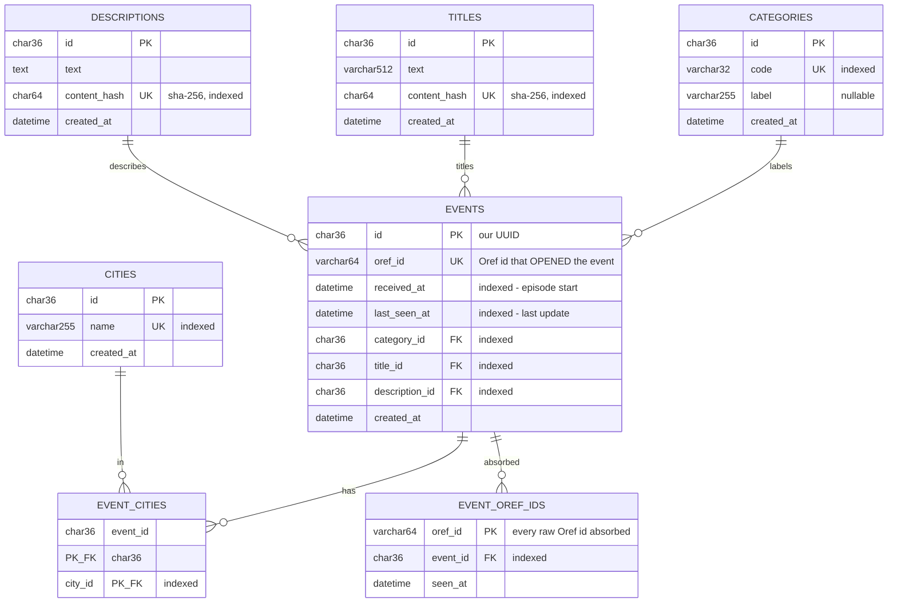

# Red Alerts - Data Model

This document describes every table, its columns/types, and how the models relate.
It is generated from the SQLAlchemy models in this folder
(`base.py`, `city.py`, `category.py`, `title.py`, `description.py`, `event.py`).

## Design principles

- **Own UUID primary key everywhere.** Every table's `id` is an application-generated
  `CHAR(36)` UUID (`UUIDMixin`). We never use a value received from the Oref API as a
  primary key. The API's alert id is kept only as `events.oref_id` (the id that OPENED the
  event) plus the full set of absorbed ids in `event_oref_ids`.
- **Events are grouped, not 1:1 with Oref ids.** Oref re-issues the same episode with a new
  `id` every few seconds. We group consecutive same-category alerts within a time window into
  ONE event and accumulate their cities (see "How events are grouped"). `event_oref_ids`
  records every raw id so each poll is processed exactly once.
- **Normalized lookups.** `cities`, `categories`, `titles`, `descriptions` each store a
  distinct value exactly once and are referenced by UUID. Encountering a new value inserts
  it once (get-or-create), then events reference it.
- **Many-to-many cities.** An event affects many cities; a city appears in many events -
  linked through the `event_cities` join table.
- **Long text is hashed for uniqueness.** `titles.text` (`VARCHAR(512)`) and
  `descriptions.text` (`TEXT`) are deduped via a `content_hash` (`CHAR(64)`, sha-256) so we
  never put a UNIQUE index on long/blob text (MySQL index-length best practice).
- **Audit timestamp.** Every table has `created_at` (`TimestampMixin`).

## ER diagram

## Tables

### `events`
One row per **logical alert episode** (grouped across many raw Oref ids), fully normalized.

| Column | Type | Constraints | Description |
| --- | --- | --- | --- |
| `id` | `CHAR(36)` | PK | Our application-generated UUID. |
| `oref_id` | `VARCHAR(64)` | NOT NULL, UNIQUE, INDEX | The Oref id of the alert that OPENED this event. All ids are in `event_oref_ids`. |
| `received_at` | `DATETIME` | NOT NULL, INDEX | When the episode STARTED (first alert, UTC). Indexed for time-ordered queries (e.g. last 24h). |
| `last_seen_at` | `DATETIME` | NOT NULL, INDEX | When an alert was last folded into this event (UTC). Drives time-window grouping. |
| `category_id` | `CHAR(36)` | NOT NULL, FK -> `categories.id`, INDEX | The alert category. |
| `title_id` | `CHAR(36)` | NOT NULL, FK -> `titles.id`, INDEX | The alert title. |
| `description_id` | `CHAR(36)` | NOT NULL, FK -> `descriptions.id`, INDEX | The alert description. |
| `created_at` | `DATETIME` | NOT NULL | Row creation time (UTC). |

### `event_oref_ids`
Every raw Oref id we've absorbed, mapped to the event it fed. The `oref_id` PK makes
re-processing a poll impossible (idempotency) and keeps a full audit trail.

| Column | Type | Constraints | Description |
| --- | --- | --- | --- |
| `oref_id` | `VARCHAR(64)` | PK | Raw Oref alert id (globally unique). |
| `event_id` | `CHAR(36)` | NOT NULL, FK -> `events.id` ON DELETE CASCADE, INDEX | The event this id rolled into. |
| `seen_at` | `DATETIME` | NOT NULL | When this raw id was absorbed (UTC). |

### `cities`
| Column | Type | Constraints | Description |
| --- | --- | --- | --- |
| `id` | `CHAR(36)` | PK | UUID. |
| `name` | `VARCHAR(255)` | NOT NULL, UNIQUE, INDEX | City name from Oref `data[]` (natural key). |
| `created_at` | `DATETIME` | NOT NULL | Row creation time (UTC). |

### `categories`
| Column | Type | Constraints | Description |
| --- | --- | --- | --- |
| `id` | `CHAR(36)` | PK | UUID. |
| `code` | `VARCHAR(32)` | NOT NULL, UNIQUE, INDEX | Oref `cat` code, e.g. `1` (rockets), `10` (all-clear). |
| `label` | `VARCHAR(255)` | NULL | Optional human-readable label. |
| `created_at` | `DATETIME` | NOT NULL | Row creation time (UTC). |

### `titles`
| Column | Type | Constraints | Description |
| --- | --- | --- | --- |
| `id` | `CHAR(36)` | PK | UUID. |
| `text` | `VARCHAR(512)` | NOT NULL | Title text as delivered by Oref. |
| `content_hash` | `CHAR(64)` | NOT NULL, UNIQUE, INDEX | sha-256 of `text` - the unique natural key. |
| `created_at` | `DATETIME` | NOT NULL | Row creation time (UTC). |

### `descriptions`
| Column | Type | Constraints | Description |
| --- | --- | --- | --- |
| `id` | `CHAR(36)` | PK | UUID. |
| `text` | `TEXT` | NOT NULL | Description text as delivered by Oref. |
| `content_hash` | `CHAR(64)` | NOT NULL, UNIQUE, INDEX | sha-256 of `text` - the unique natural key. |
| `created_at` | `DATETIME` | NOT NULL | Row creation time (UTC). |

### `event_cities` (join table)
| Column | Type | Constraints | Description |
| --- | --- | --- | --- |
| `event_id` | `CHAR(36)` | PK (composite), FK -> `events.id` ON DELETE CASCADE | The event. |
| `city_id` | `CHAR(36)` | PK (composite), FK -> `cities.id` ON DELETE CASCADE, INDEX | The city. |

## Relationships

- `Event.category` -> one `Category` (`events.category_id`); `Category.events` -> many `Event`.
- `Event.title` -> one `Title`; `Title.events` -> many `Event`.
- `Event.description` -> one `Description`; `Description.events` -> many `Event`.
- `Event.cities` <-> `City.events` - many-to-many via `event_cities`.
- `Event.oref_ids` -> many `EventOrefId` (every raw id absorbed into the event).

## How events are grouped (`Event.ingest`)

Oref hands out a NEW `id` for the same evolving episode every couple of seconds, so the id
alone cannot dedupe. `Event.ingest` instead decides whether each incoming alert continues an
open event or starts a new one. An event is **open** when it is the most recent event of its
category whose `last_seen_at` is within `EVENT_MERGE_WINDOW_SECONDS` (default `120`) of now.

| # | Situation | Outcome |
| --- | --- | --- |
| 1 | The exact same raw id is polled again (active alert re-sent every 1s) | recorded once in `event_oref_ids`; the repeat is a no-op (`None`) |
| 2 | No open event of this category | open a NEW event (`created`) |
| 3 | Open event exists and the alert adds a city | union the city, slide `last_seen_at` (`updated`) |
| 4 | Open event exists but the alert only repeats / drops cities | cities are KEPT, never removed; nothing new (`unchanged`) |
| 5 | Same category but the previous episode ended (gap > window) | open a NEW event - the time gap separates two same-category episodes (`created`) |

The worker broadcasts on `created`/`updated` only. **Known trade-off:** two genuinely distinct
episodes of the same category that overlap within the window merge into one (cities unioned);
Oref exposes no reliable signal to split those, so we lean on the start->end->restart lifecycle
(time). Tune `EVENT_MERGE_WINDOW_SECONDS` to trade splitting vs. over-merging.

## How the schema is created / evolved

There are **no migration files**. The models in this folder are the single source of truth;
`sync_database()` (`sync.py`) makes the database match them - the Sequelize
`sync({ alter: true })` equivalent:

1. Edit a model (add a column, an index, a whole table, ...).
2. Run `make sync prod local` (or `app/sync_db.py`). It diffs `Base.metadata` against the
   **live** schema and applies the difference in place: create tables, add columns, add/drop
   indexes and constraints, fix nullability.

It is **manual only** - the worker never syncs on boot/deploy; you trigger it when ready.
Under the hood it reuses Alembic's autogenerate engine in memory (`produce_migrations` +
`Operations`) - the same diff `alembic revision --autogenerate` would produce, executed
immediately instead of written to a file.

**Safety / caveats** (same shape as Sequelize `alter:true`):

- **Additive by default.** `sync_database()` will create/alter, but will NOT drop a table or
  column even if you remove it from the models - the drop is logged and skipped. Pass
  `sync_database(allow_drops=True)` for the destructive variant.
- **Renames look like drop + add.** A renamed column/table is seen as "remove old, add new",
  i.e. potential data loss. Do renames by hand (or with `allow_drops` + care).
- Requires the DB user to have DDL privileges (`CREATE` / `ALTER` / `INDEX`).
- To wipe all data while keeping the schema: `resources/sql/reset_database.sql`.
